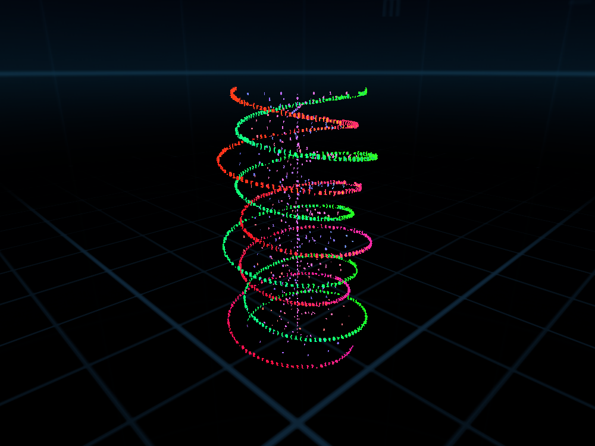
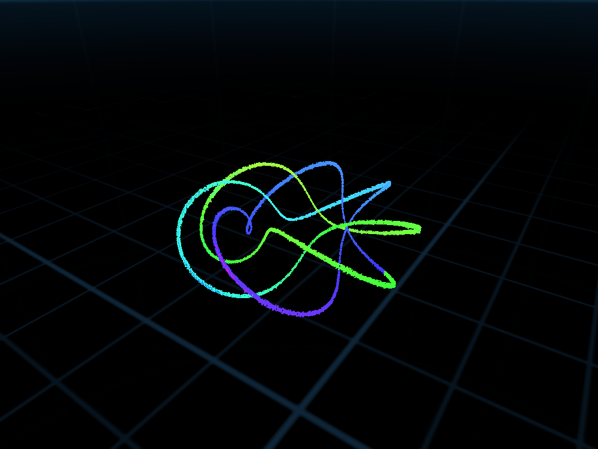
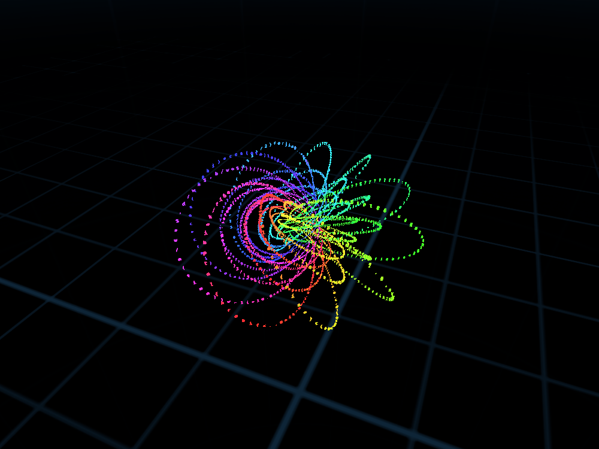
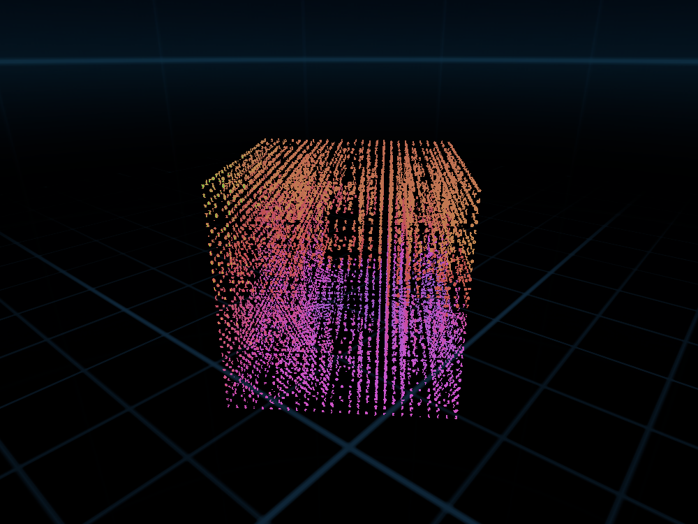

# Immersive Code Calligram IDE

**코드의 글자로 그리는 3D 캘리그램.** 작은 스크립트 언어로 도형을 정의하면, 그 소스 코드의 글자 자체가 순서대로 배치되어 3차원 형상의 표면과 궤적을 이룹니다. visionOS의 완전 몰입 공간에서 눈앞에 띄우고, macOS/iOS 창에서는 가상 카메라로 회전·확대하며 실시간으로 코드를 고칠 수 있습니다.

<p align="center">
  
  
  <br/>
  
  
</p>

<p align="center"><sub>모든 이미지는 macOS 프리뷰 캔버스를 오프스크린으로 렌더링한 실제 결과물입니다 (셰이더·메시 동일, UI 패널 제외).</sub></p>

---

## 이게 뭔가요

사용자는 창에 열린 코드 에디터에 기하/알고리즘 스크립트를 입력합니다. 앱은 그 코드를 파싱·실행해 점(point)들을 만들고, 각 점에는 **소스 코드에서 공백을 뺀 글자**가 `emit()` 호출 순서대로 하나씩 배치됩니다. 결과물은 "글자로 그려진 도형"이며, 코드를 고치면 0.5초 안에 도형이 다시 그려집니다.

용도는 정해져 있지 않습니다 — 수학 시각화, 코드 아트, 교육용 데모 등에 쓸 수 있는 **"코드 → 즉시 3D 프리뷰"** 루프에 집중한 프로젝트입니다.

## 주요 기능

- **CalligramScript** — Swift 문법에 가까운 소형 DSL. `let/var`, `for i in a..<b`, `if/else`, 30여 개의 수학 함수(`sin cos sinh sqrt fract atan2 clamp lerp random …`)와 씬 내장 함수(`emit color hsv size glyph`)를 제공하는 트리 워킹 인터프리터입니다. 실제 Swift를 실행하는 게 아니라 자체 언어를 안전하게(스텝·emit 한도 포함) 해석합니다.
- **샘플 29종, 7개 카테고리** — 곡선·매듭(DNA 이중 나선, 세잎 매듭 튜브, 마우러 장미…), 곡면(뫼비우스 띠, 클라인 병, 슈퍼포뮬러…), 끌개·카오스(로렌츠, 클리퍼드…), 프랙탈·IFS(줄리아 집합, 멩거 스펀지, 반슬리 고사리…), 격자·필드, 4차원·위상(호프 올뭉치, 클리퍼드 토러스), 타이포그래피까지 바로 열어볼 수 있습니다.
- **코드 → 수학 수식 자동 변환** — 편집기 아래 패널이 현재 코드를 실행할 때마다 `∀ i ∈ {0, …, n−1}`, `√`, `π`, `HSV(…)` 같은 수학 표기로 다시 써서 보여줍니다. 수식만 보고도 알고리즘의 구조를 읽을 수 있습니다.
- **항상 보이는 글리프 (교차 평면)** — 글리프 쿼드를 서로 직각인 두 평면으로 만들어, 도형이 회전하다가 옆면이 되어 사라지는 문제를 없앴습니다.
- **Iridescent 글리프 머티리얼** — MaterialX 셰이더 그래프로 시선 각도에 따라 색상이 스펙트럼을 따라 이동하는 무지갯빛 효과를 냅니다. 강도는 0으로 낮춰 원래 스크립트 색을 그대로 쓸 수도 있습니다.
- **몰입 공간 + 창 프리뷰 동시 지원** — visionOS에서는 `.immersionStyle(.full)` SkyDome 안에 도형이 떠 있고, macOS/iOS 창에서는 같은 씬 컨트롤러를 가상 카메라로 드래그 회전·핀치 확대할 수 있습니다.

## CalligramScript 맛보기

```swift
// 이중 나선: 두 가닥 + 염기쌍 가로대
let n = 420
let turns = 4.5
for i in 0..<n {
    let t = i / n
    let a = t * TAU * turns
    let r = 0.22 + 0.04 * sin(t * TAU * 3)
    let y = t * 0.9 - 0.45
    hsv(0.55 + 0.2 * t, 0.8, 1)
    size(0.026)
    emit(cos(a) * r, y, sin(a) * r)
    hsv(0.02 + 0.1 * t, 0.85, 1)
    emit(cos(a + PI) * r, y, sin(a + PI) * r)
}
```

이 코드는 자동으로 다음과 같은 수식 표기로도 표시됩니다.

```
∀ i ∈ {0, …, n − 1}:
    t = i/n
    a = t · 2π · turns
    r = 0.22 + 0.04 sin(t · 2π · 3)
    C ← HSV(0.55 + 0.2t, 0.8, 1)
    P ← (cos(a) · r, y, sin(a) · r)
```

## 시작하기

**요구 사항**: visionOS 27 / macOS 27 / iOS 27 SDK가 포함된 Xcode.

1. `Immersive Code Calligram IDE.xcodeproj`를 Xcode로 엽니다.
2. 실행 대상을 고릅니다.
   - **My Mac** — 별도 기기 없이 창 안 프리뷰 캔버스로 바로 확인 (드래그: 회전 · 핀치: 거리).
   - **Apple Vision Pro (Simulator/Device)** — 창의 "이머시브 공간 진입" 버튼으로 SkyDome 안에서 실물 크기로 확인.
3. `Cmd + R`로 빌드·실행합니다. 에디터 상단 "샘플" 메뉴에서 원하는 도형을 골라 시작하세요.

## 프로젝트 구조

```
Immersive Code Calligram IDE/
├─ MyApp.swift, ContentView.swift
├─ Model/            AppModel(@Observable), CalligramRenderSettings
├─ Language/         Lexer → AST → Parser → Interpreter → Engine
│                     CalligramMathFormatter (코드→수식), CalligramSamples (29종)
├─ Rendering/         GlyphAtlas, CalligramMeshBuilder, EnvironmentTextureRenderer,
│                     IridescentGlyphMaterial(MaterialX), SpinSystem, CalligramSceneController
└─ Views/             CodeEditorView, ControlPanelView, PreviewCanvasView,
                      ImmersiveCalligramView, ImmersiveToggleButton
Docs/                 PRD, 작업 목록
```

더 자세한 아키텍처와 데이터 흐름은 [`Docs/PRD-CodeCalligram.md`](Docs/PRD-CodeCalligram.md)를 참고하세요.

## 라이선스

[Apache License 2.0](LICENSE)
